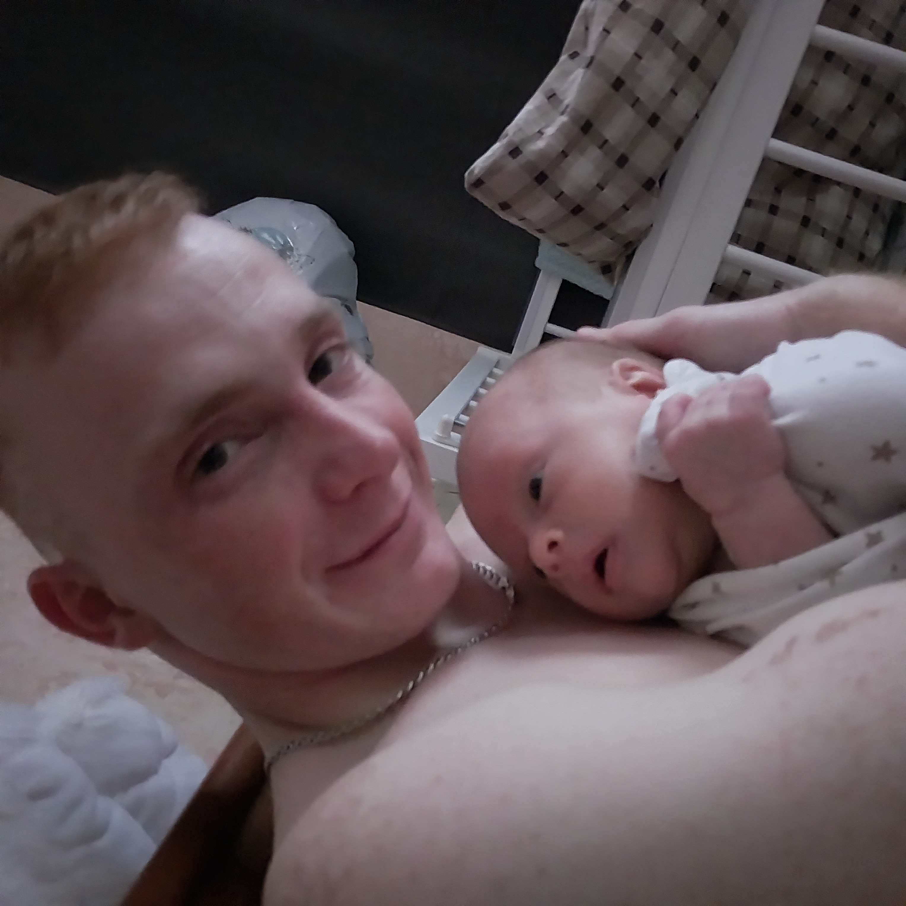
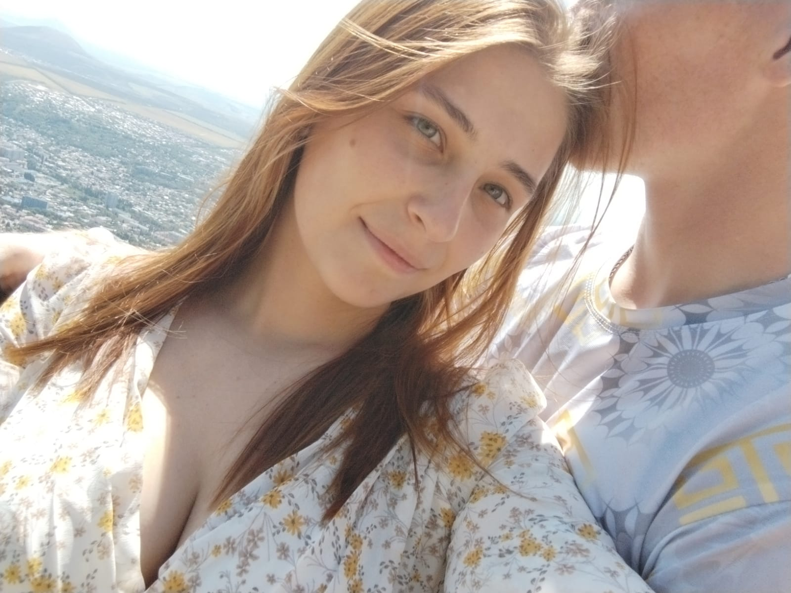

# Привет, меня зовут Татьяна 👋

## Обо мне

Я **начинающий андроид разработчик** и изучаю *веб-технологии*.

### Мои навыки

- Python
- JavaScript
- Git и GitHub

### Я молодая мама моему сыночку пол годика и его зовут Костик.

## Фото

## Контакты

| Платформа | Ссылка |
|-----------|--------|
| GitHub | [@tany](https://github.com/tanuskarogova656-boop) |
| Email | tany.rogova.02@mail.ru |

## Цитата

«Жизнь — это то, что с тобой происходит, пока ты строишь планы.» — Джон Леннон

